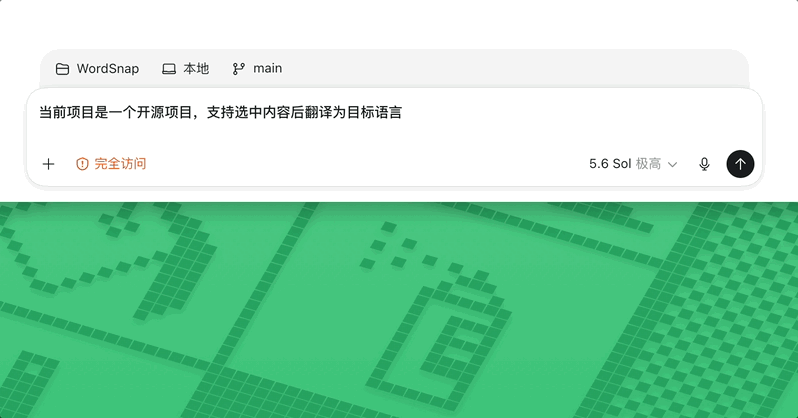
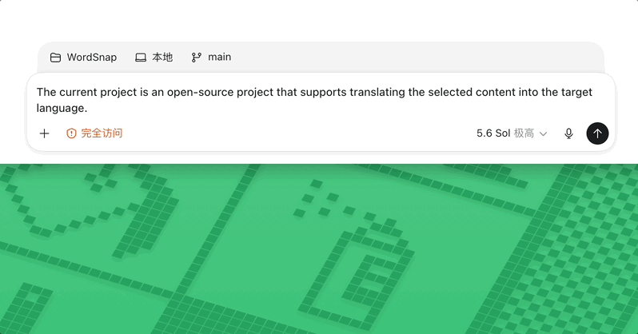

<p align="center">
  
</p>

<h1 align="center">WordSnap</h1>

<p align="center">Select text, press a shortcut, and get an AI translation in place.</p>

<p align="center">
  <a href="README.md">简体中文</a> · <strong>English</strong>
</p>

<p align="center">
  <a href="https://github.com/YunFy26/WordSnap/actions/workflows/ci.yml"></a>
  <a href="LICENSE"></a>
</p>

WordSnap is a lightweight desktop AI translation utility. Select copyable text in any application, press `Option+T` on macOS or `Alt+T` elsewhere, and the translation appears near the selection. Foreign-language input is translated into the configured target language; Simplified Chinese input is turned into natural English.

Settings and saved words stay on your device. The selected text is sent to the OpenAI-compatible API that you configure.

<p align="center">
  <a href="https://github.com/YunFy26/WordSnap/releases/latest">Download the latest release</a> ·
  <a href="CONTRIBUTING.md">Contributing</a> ·
  <a href="docs/PRIVACY.md">Privacy</a> ·
  <a href="SECURITY.md">Security</a>
</p>

## Demo

### Chinese to English



### English to Chinese



## Features

- Translate copyable selected text in any application with `Option+T` / `Alt+T`.
- Translate foreign-language text into your target language and Simplified Chinese into natural English.
- Show the result near the selection and dismiss completed cards by clicking outside them.
- Stay visible over native full-screen apps and multiple Spaces on macOS without stealing focus.
- Save only single ASCII English words, optionally hyphenated, to a local SQLite word list.
- Update the translation, lookup count, and last-seen time when a word is looked up again.
- Open the word list, settings, and quit action from the menu bar or system tray.
- Configure an OpenAI-compatible Base URL, model ID, and target language.
- No accounts, cloud sync, advertising, or telemetry.

## Download and run

Download a portable build or installer for your platform from [GitHub Releases](https://github.com/YunFy26/WordSnap/releases/latest).

| Platform | Recommended download | Other formats |
| --- | --- | --- |
| macOS Apple Silicon | `WordSnap_<version>_macos-aarch64_portable.zip` | `.dmg` |
| macOS Intel | `WordSnap_<version>_macos-x64_portable.zip` | `.dmg` |
| Windows x64 | `WordSnap_<version>_windows-x64_portable.zip` | `.msi`, NSIS `.exe` |
| Linux x64 | `.AppImage` | `.deb`, `.rpm` |

Portable builds do not need installation. Extract the archive and run `WordSnap.app` or `WordSnap.exe`. For an AppImage, run `chmod +x WordSnap_*.AppImage` first.

> [!NOTE]
> Current releases are unsigned. If macOS Gatekeeper blocks the first launch, right-click `WordSnap.app` and choose **Open**, or run `xattr -cr WordSnap.app`. Windows may also show a SmartScreen warning.

## First use

1. Start WordSnap and click its menu bar or system tray icon.
2. Open **Settings…** and enter your API key.
3. Change the Base URL, model ID, or target language if needed.
4. Select copyable text in any application.
5. Press `Option+T` on macOS or `Alt+T` to translate it.

Default configuration:

| Setting | Default |
| --- | --- |
| Base URL | `https://api.openai.com/v1` |
| Model | `gpt-4o-mini` |
| Target language | Simplified Chinese |

On macOS, reading the selection may require Accessibility permission. If WordSnap cannot capture already selected text, allow it under **System Settings → Privacy & Security → Accessibility**.

## Configuration and data

The Base URL may include or omit its scheme. WordSnap normalizes it and appends `/chat/completions` when necessary; a URL that already ends in that path is used as-is. Use HTTPS for remote services. Plain HTTP is intended only for an explicitly local development endpoint.

Local data is stored in the application data directory assigned by Tauri:

- `settings.json`: API key, Base URL, model, and target language.
- `wordsnap.sqlite3`: English words, translations, lookup counts, and timestamps.

> [!IMPORTANT]
> Selected text is sent to the API service you configure. The API key is currently stored as plain text in the local `settings.json`; WordSnap does not use the system keychain. Read [Privacy and data handling](docs/PRIVACY.md) before use.

## Run from source

### Requirements

- Node.js 20 or later and npm
- Rust stable with `rustfmt` and Clippy
- The [Tauri 2 system prerequisites](https://v2.tauri.app/start/prerequisites/) for your platform
- An OpenAI-compatible API key

### Start the desktop app

```bash
git clone https://github.com/YunFy26/WordSnap.git
cd WordSnap
npm ci
npm run tauri dev
```

### Check and package

```bash
npm run check
npm run audit
npm run tauri build
```

| Command | Purpose |
| --- | --- |
| `npm run build` | Type-check and build the Vite frontend |
| `npm run format:check` | Check Rust formatting |
| `npm run lint` | Run strict Clippy checks for all Rust targets |
| `npm test` | Run the Rust unit tests |
| `npm run check` | Run the build, format check, Clippy, and tests |
| `npm run audit` | Check high-severity npm advisories using the official registry |
| `npm run tauri dev` | Start the complete desktop app in development mode |
| `npm run tauri build` | Build application packages for the current platform |
| `npm run icons` | Regenerate application and tray icons from their source files |

Run `npm run audit` whenever dependencies change. Local packages are written to `src-tauri/target/release/bundle/`.

## How it works

1. The shortcut records the current pointer position.
2. WordSnap snapshots the clipboard, simulates copy, reads the selection, and attempts to restore the original clipboard.
3. It builds an OpenAI-compatible `/chat/completions` request from the input and settings.
4. A loading state and the result appear near the selection.
5. After translation completes, clicking outside the card hides it.
6. If the input is a single ASCII English word, WordSnap inserts or updates it in the local word list.

Phrases, sentences, Chinese text, and failed translations are never written to the word list.

## Project structure

```text
.
├── docs/                    # Privacy, release documentation, and demos
├── scripts/                 # Icon generation scripts
├── src/                     # TypeScript window views and styles
├── src-tauri/               # Tauri configuration, Rust backend, and app resources
│   ├── capabilities/        # Tauri permissions available to the frontend
│   ├── icons/               # Application and tray icons
│   └── src/lib.rs           # Shortcut, selection, translation, word list, and window logic
├── CONTRIBUTING.md          # Contribution workflow
├── SECURITY.md              # Security reporting and support policy
└── package.json             # npm commands and frontend dependencies
```

Primary entry points:

- `src-tauri/src/lib.rs`: application state, global shortcut, selection capture, translation requests, SQLite, windows, and tray.
- `src/main.ts`: translation card, word list, settings, and tray-menu views.
- `src/styles.css`: production UI styling and light/dark behavior.
- `src-tauri/tauri.conf.json`: window, bundle, and Tauri security configuration.

## CI and releases

- `CI` runs the build, Rust formatting check, Clippy, tests, and npm audit for pushes and pull requests targeting `main`.
- `Release` builds macOS Apple Silicon, macOS Intel, Windows x64, and Linux x64 packages for every push to `main`, then publishes a GitHub Release.

See [docs/RELEASE.md](docs/RELEASE.md) for package formats, portable builds, and unsigned-release behavior.

## Troubleshooting

### The shortcut does not respond

- Make sure WordSnap is running and no other application owns `Option+T` / `Alt+T`.
- Check Accessibility permission on macOS.
- Confirm that the selected text can be copied normally.

### Translation fails

- Check the API key, Base URL, and network connection.
- Confirm that the configured model is available to the current API key.
- Never post API keys or private text in issues, logs, or screenshots.

Report bugs through [GitHub Issues](https://github.com/YunFy26/WordSnap/issues). Report vulnerabilities privately by following the [Security Policy](SECURITY.md).
